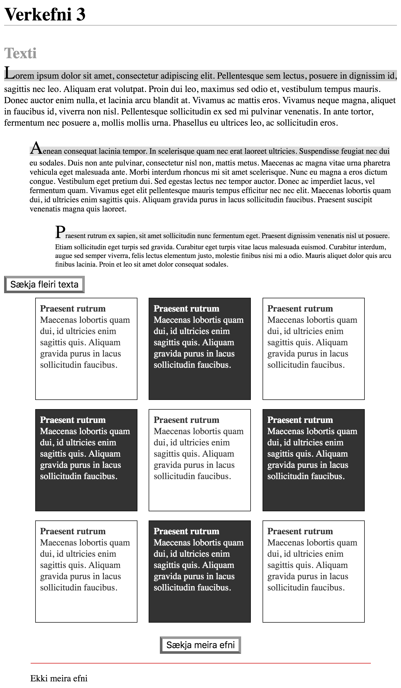
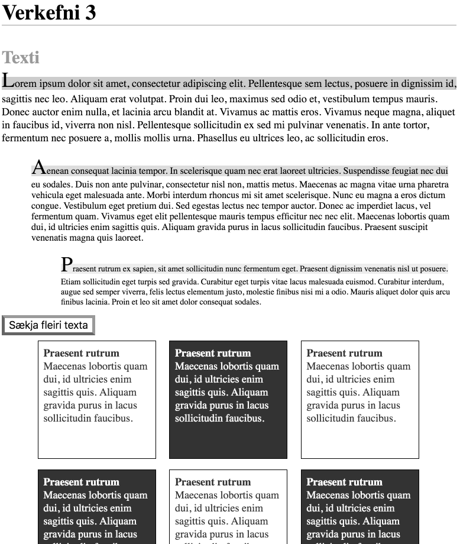

# Verkefni 3

## Lýsing

Skrifa skal CSS til að láta gefið HTML líta út eins og gefin fyrirmynd (`fyrirmynd.png`).

Ekki er leyfilegt að breyta HTML skjali nema til þess að tengja CSS við það, þ.e.a.s. ekki má breyta því sem er innan `<body>`.

### Almennt

Grunnstærð leturs skal vera `18px` og aðeins skal nota `em` einingar fyrir stærðir fyrir utan:

* Skilgreiningu á grunnstærð
* Þykkt á `border`

Útlit þarf aðeins að vera rétt í a.m.k. 800px breiðum Chrome vafra.

### Fyrirsagnir & takkar

`h1` fyrirsögn skal aðeins hafa margin að neðan og skal það vera `36px`. Leturstærð fyrirsagnar skal vera `36px`. Fyrir neðan fyrirsögn skal vera `1px` breið línu með litinn `#999`.

`h2` fyrirsagnir skulu ekki hafa neitt margin. Leturstærð fyrirsagna skal vera `30px`. Litur fyrirsagna skal vera `#999`.

Ekki skal birta `h2` fyrirsögn undir `.card-section`.

`h3` fyrirsagnir skulu ekki hafa neitt margin. Leturstærð fyrirsagna skal vera `18px`.

### Takkar

Takkar skulu hafa `5px` border. Efri og hægri partur skulu hafa litinn `#999` en neðri og vinstri `#666`.

Letur stærð takka skal vera `18px`.

Þegar _hoverað_ er yfir takka skal breidd stækka úr `5px` í `10px` litir skiptast, þ.e.a.s., efri og hægri partur skulu hafa litinn `#666` en neðri og vinstri `#999`.

### Texti

Fyrsta textablokk:

* Letur stærð `18px`
* Margin vinstra megin `0px`
* Fyrsta lína skal vera með bakgrunnslit `#ccc`
* Fyrsti stafur skal vera `36px`

Önnur textablokk:

* Letur stærð `16px`
* Margin vinstra megin `50px`
* Fyrsta lína skal vera með bakgrunnslit `#ddd`
* Fyrsti stafur skal vera `36px`

Þriðja textablokk:

* Letur stærð `14px`
* Margin vinstra megin `100px`
* Fyrsta lína skal vera með bakgrunnslit `#eee`
* Fyrsti stafur skal vera `36px`

### Kort

Kort (eða „cards“) eru oft notuð í hönnun á vefnum. Þau aðskilja efni á einhvern hátt og eru oft birt saman í listum.

Fyrir okkar kort gildir:

* Innan `.cards` element eiga kort að raðast _inline_, þ.e.a.s. vera hlið við hlið
* Breidd og hæð þeirra eiga að vera `180px`
* Margin og padding eiga að vera `9px` á allar hliðar
* `1px` svart border á að vera utanum þau
* Oddatölu kort hafa `#fff` bakgrunn og `#333` litaðann texta
* Jafntölu kort hafa `#333` bakgrunn og `#fff` texta

Fyrir `.cards` element gildir:

* Þegar mús fer yfir element eiga bakgrunnar og litir korta að víxlast, sjá `hover.gif`
* Má mest verða `666px` breitt
* Miðja á element á síðu
* Takki innan elements skal hafa `36px` margin að ofan og neðan
* Bæta skal við texta eftir takka sem segir „Ekki meira efni“, með `18px` margin að ofan og neðan, `1px` border með `#c00` lit, og `18px` padding að ofan

### Annað

Aðeins er leyfilegt að nota eftirfarandi yfirlýsingar í CSS:

* `background-color`
* `border` og `border-top` o.fl.
* `color`
* `content`
* `display`
* `font-size`
* `height`
* `margin` og `margin-top` o.fl.
* `max-width`
* `padding` og `padding-top` o.fl.
* `width`

Leyfilegt er að nota alla selectora.

CSS skal vera án villna og viðvarana þegar keyrt í gegnum https://jigsaw.w3.org/css-validator/

## Mat

* 20% – Snyrtilega uppsett og gilt CSS tengt við HTML
* 20% – Aðeins leyfileg eigindi notuð og `em` notað fyrir stærðir
* 20% – Útlit á fyrirsögnum og tökkum rétt
* 20% – Útlit á texta rétt
* 20% – Útlit á kortum rétt

## Sett fyrir

Verkefni sett fyrir í fyrirlestri mánudaginn 10. september 2018.

## Skil

Skila skal undir „Verkefni og hlutaprófa“ á Uglu í seinasta lagi fyrir lok dags þriðjudaginn 18. september 2018.

Skilaboð skulu innihalda slóð á verkefni ásamt zip skjali með lausn sem heitir ``verkefni3-<notendanafn>.zip`, t.d. `verkefni3-osk.zip`.

## Einkunn

Sett verða fyrir tíu minni verkefni þar sem átta bestu gilda 3,5% hvert, samtals 28% af lokaeinkunn.

Sett verða fyrir tvö hópverkefni þar sem hvort um sig gildir 11%, samtals 22% af lokaeinkunn.

---

> Útgáfa 0.1
